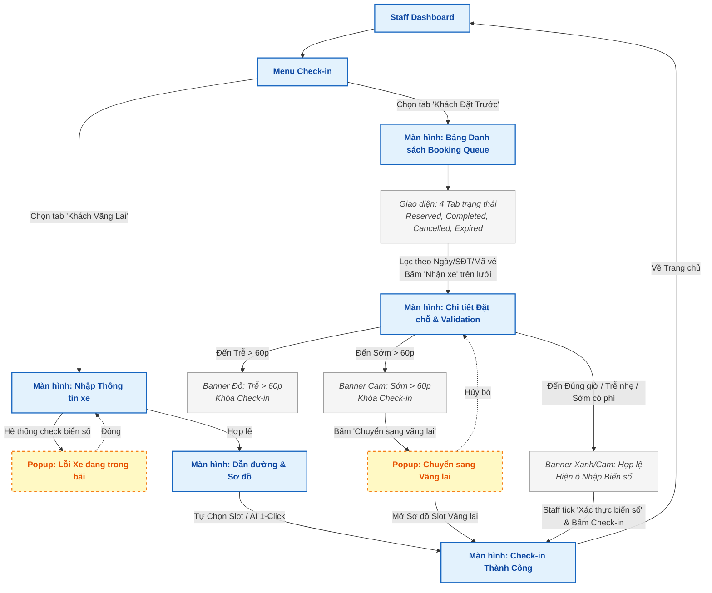
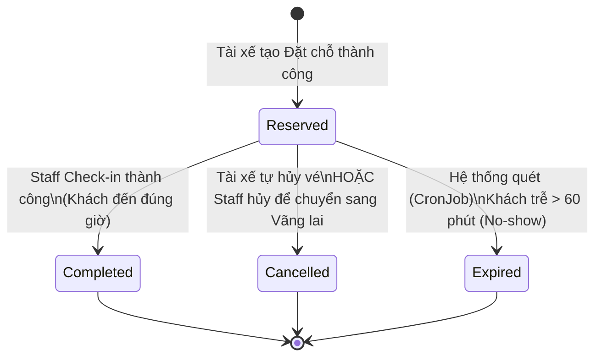
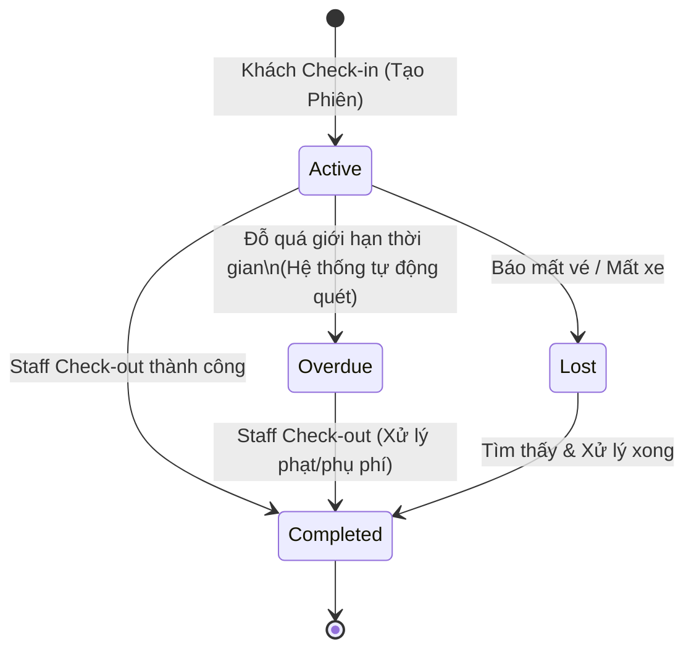
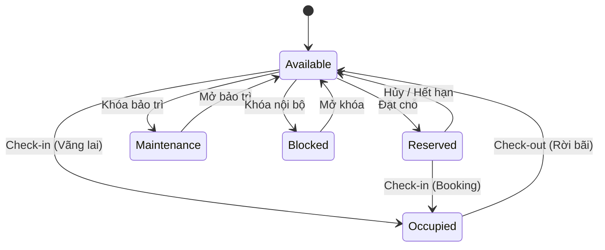

# TÀI LIỆU THIẾT KẾ HỆ THỐNG - PARKING MANAGEMENT (SWP391)

Tài liệu này tổng hợp toàn bộ các sơ đồ hệ thống cốt lõi nhất (Screen Flow và State Chart) đã được chuẩn hóa theo đúng cấu trúc mã nguồn và chuẩn UML.

---

## PHẦN 1: SCREEN FLOW (LUỒNG MÀN HÌNH)

### 1. Luồng Driver Booking (Tài xế Đặt chỗ)
*Mô tả: Sử dụng cơ chế Single Page Application để chọn thông tin, cập nhật sơ đồ Slot theo thời gian thực và tích hợp AI gợi ý.*

```mermaid
graph TD
    classDef screen fill:#E3F2FD,stroke:#1565C0,stroke-width:2px,color:#0D47A1,font-weight:bold;
    classDef popup fill:#FFF9C4,stroke:#F57F17,stroke-width:2px,color:#E65100,font-weight:bold,stroke-dasharray: 5 5;
    classDef component fill:#F5F5F5,stroke:#9E9E9E,stroke-width:1px,color:#424242,font-style:italic;

    Home[Màn hình: Driver Home]:::screen
    Form[Màn hình Single Page: Driver Booking]:::screen
    
    Fetch[Logic ngầm: API Fetch Slot Real-time]:::component
    MapDisplay[Giao diện Sơ đồ đỗ xe<br/>nằm ngay dưới Form]:::component
    
    Confirm[Màn hình: Booking Confirmation]:::screen

    Home -->|Bấm 'Đặt chỗ'| Form
    
    Form -->|Dropdown Chọn Xe đã lưu<br/>HOẶC Nhập biển số tay| Form
    Form -->|Thay đổi Ngày/Giờ/Thời lượng/Xe| API[Logic ngầm: API Fetch Slot Real-time]:::component
    API -->|Có slot trống| Map[Giao diện Sơ đồ đỗ xe<br/>nằm ngay dưới Form]:::screen
    API -->|Lỗi / Không có slot| Full[Popup: Lỗi Thời gian / Bãi Full]:::popup
    
    Full -.->|Đóng, Sửa lại form| Form
    
    %% Tương tác Bản đồ
    Filter[Bộ lọc: Chọn Tầng & Khu vực]:::component -.-> Map
    
    Auto{Bật tính năng<br/>'Auto-select' ?}:::component
    Map --> Auto
    Auto -->|Bật| AI[Hệ thống tự động bắt Slot tốt nhất]:::component
    Auto -->|Tắt| Manual[Khách tự bấm vào ô Slot trống trên bản đồ]:::component
    
    AI --> Submit[Bấm 'Tiến hành Đặt chỗ']
    Manual --> Submit
    
    %% Đặt chỗ
    Submit --> Validate[Validate cuối cùng & Gọi API]:::component
    
    %% Nhánh thành công
    Validate -->|Thành công| Confirm[Màn hình: Booking Confirmation]:::screen
    
    %% Nhánh thất bại
    Validate -.->|Thất bại (Slot bị người khác đặt trước)| RefreshAPI[Cập nhật lại Sơ đồ Real-time]:::component
    RefreshAPI -.-> API
    
    Confirm -->|Bấm 'Về Trang chủ'| Home
```

### 2. Luồng Staff Check-in (Xử lý Vãng lai & Đặt trước)
*Mô tả: Tích hợp 2 luồng Walk-in và Booking trên cùng một Dashboard. Cho phép xử lý linh hoạt các ca khách hàng đến quá sớm hoặc quá trễ.*



### 3. Luồng Staff Check-out & Thanh toán
*Mô tả: Tích hợp logic phân tích tính phí tự động (Fee Breakdown), kiểm tra miễn phí đến sớm và Polling mã QR tự động.*

```mermaid
graph TD
    classDef screen fill:#E3F2FD,stroke:#1565C0,stroke-width:2px,color:#0D47A1,font-weight:bold;
    classDef popup fill:#FFF9C4,stroke:#F57F17,stroke-width:2px,color:#E65100,font-weight:bold,stroke-dasharray: 5 5;
    classDef component fill:#F5F5F5,stroke:#9E9E9E,stroke-width:1px,color:#424242,font-style:italic;

    D[Màn hình: Staff Dashboard]:::screen
    List[Màn hình: Active Sessions]:::screen
    FeeModal[Popup: Fee Breakdown]:::popup
    Pay[Màn hình: Staff Payment Confirm]:::screen
    Success[Màn hình: Trả xe Thành công]:::screen

    D -->|Bấm 'Trả xe'| List
    List -->|Tìm kiếm & Lọc xe| List
    List -->|Bấm Icon Xem phí| FeeModal
    FeeModal -->|Tính phí Theo Block giờ / Qua đêm| FeeModal
    FeeModal -.->|Tắt| List
    List -->|Bấm 'Thanh toán & Trả xe'| Pay
    
    %% Màn hình Thanh toán
    EarlyCheck{Logic: Trả xe<br/>sớm hơn giờ Book?}:::component
    Pay --> EarlyCheck
    EarlyCheck -->|Có| AlertEarly[Cảnh báo: Miễn phụ phí đến sớm]:::component
    EarlyCheck -->|Không| ValidatePlate
    AlertEarly --> ValidatePlate
    
    ValidatePlate[Bắt buộc tick:<br/>'Xác nhận Biển số khớp']:::component
    
    %% Nút Recheck
    Recheck[Nút: Làm mới Trạng thái<br/>(Gọi API kiểm tra lại)]:::component
    Pay -.->|Phòng hờ lỗi mạng| Recheck
    Recheck -.-> LogicPay
    
    ValidatePlate --> LogicPay{Trạng thái Tiền?}:::component
    
    LogicPay -->|Đã trả đủ / Prepaid| SurchargeCheck{Có lố giờ không?}:::component
    SurchargeCheck -->|Không| PaidAction[Bấm 'Xác nhận Kết thúc']
    SurchargeCheck -->|Có| SurchargeAlert[Cảnh báo: Thu thêm Phụ phí bằng Tiền mặt]:::component
    SurchargeAlert --> PaidAction
    PaidAction --> Success
    
    LogicPay -->|Chưa thanh toán (Có phí)| PaySelect[Chọn Tiền mặt / QR PayOS]:::component
    PaySelect -->|Tiền mặt| Cash[Bấm 'Đã thu tiền mặt']
    Cash --> Success
    
    PaySelect -->|QR Code| QRModal[Popup: QR Tự động Polling]:::popup
    QRModal -->|Khách quét & Chuyển khoản xong| Success
    QRModal -.->|Giao dịch Hủy/Lỗi/Hết hạn| PaySelect
    
    Success -->|Về Trang chủ| D
```

---

## PHẦN 2: STATE CHART (BIỂU ĐỒ TRẠNG THÁI)

### 1. Vòng đời Đặt chỗ (Reservation Lifecycle)
*Mô tả: Một vé đặt chỗ có điểm bắt đầu và kết thúc rõ ràng khi hoàn thành nhiệm vụ hoặc bị quá hạn.*



### 2. Vòng đời Phiên đỗ xe (Parking Session Lifecycle)
*Mô tả: Thể hiện chính xác 4 trạng thái lưu trữ trong Database (Bảng ParkingSessions - cột SessionStatus). Trạng thái thanh toán được tách biệt quản lý ở bảng Payments.*



### 3. Vòng đời Vị trí đỗ (Slot Status Lifecycle)
*Mô tả: Slot là đối tượng vật lý/cố định, bao gồm đủ 5 trạng thái theo chuẩn CSDL: Available, Occupied, Reserved, Maintenance, Blocked. Đây là một Cỗ máy trạng thái vòng lặp (Cyclic State Machine) không có điểm kết thúc (No End State).*



---
*Created by Antigravity AI - System Documentation Module*
